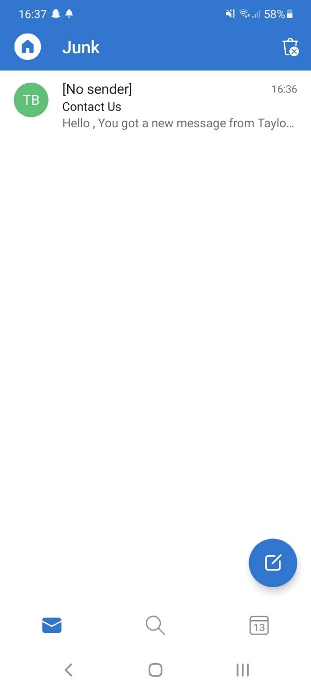
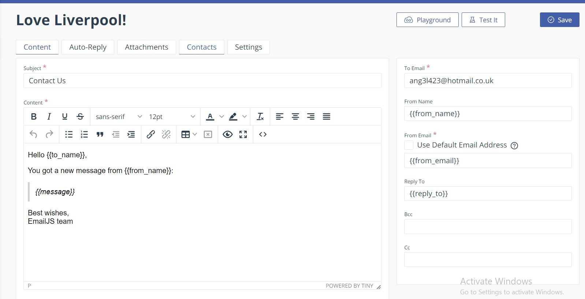
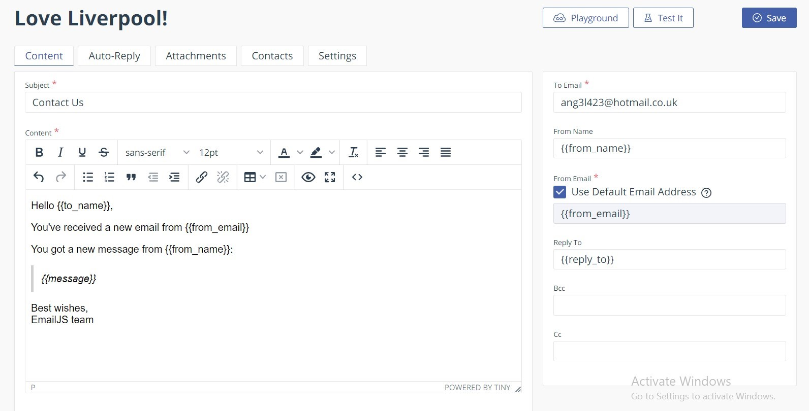
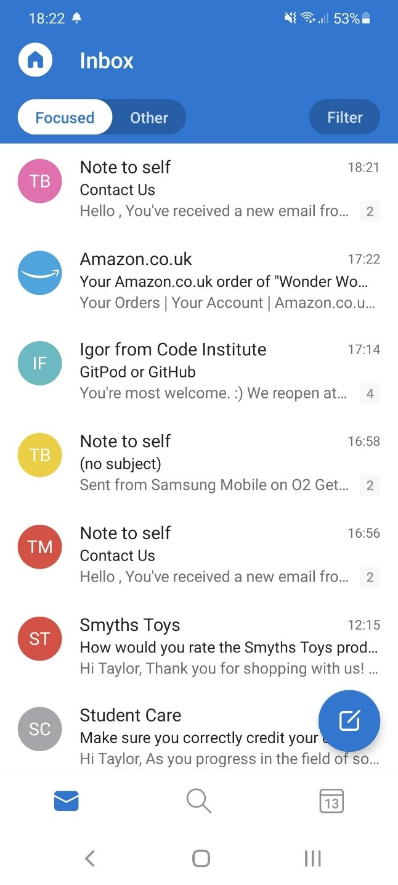
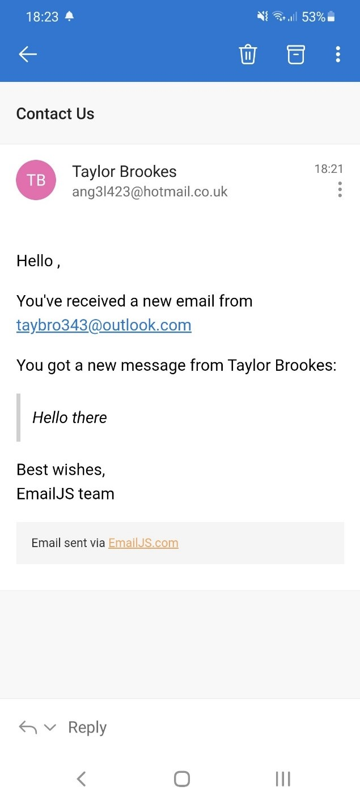

# Taylor Brookes - Milestone Project 2
## Love Liverpool!

[Visit my live website here!](https://taybro23.github.io/liverpool/)

## Table Of Contents
1. Overview
2. UX
    - Target Audience
    - User Stories
    - Wireframes
3. Design
    - Structure
    - Typography
    - Colours
    - Imagery
4. Features
    - Responsiveness
    - Navbar
    - Scroll To Top Button
    - Places Of Interest
    - Liverpool One
    - Contact Us
    - Footer
    - Future Deployments
5. Technologies Used
    - Languages
    - Frameworks, Libraries and Frameworks
6. Testing
    - HTML, CSS and JS
    - Features and Functionality
    - User Story Testing
    - Bugs and Fixes
7. Deployment
8. Credits
    - Images
    - Code
    - Acknowledgements  

# Overview

Love Liverpool is a site designed for people who are visiting Liverpool, and I have focused mainly on Liverpool One due to it being 
one of the most popular areas to visit within Liverpool. I have chosen to feature six of the most popular places of interest on my site 
and have included a small amount of information about each one, as well as providing contact information and links to the official websites. 
Below that is a map showing fifteen places to stay, restaurants and shops within Liverpool One. There is then a contact form to allow 
users to ask any relevant questions they have regarding the site or Liverpool itself. 

# UX (User Experience)
## Target Audience

The target audience for this site is people who are interested in visiting Liverpool for recreational purposes. I have selected some 
must-see places, as well as included a range of hotels, restaurants and shops so that people can see what Liverpool has to offer and 
plan their trip in advance.  

## User Stories
### First time and returning users

-	To understand what the site is and what it is to be used for
-	Easy navigation of the entire site regardless of device used 
-	The best places to visit during a trip to Liverpool
-	All information to be provided clearly and concisely
-	Relevant information to be provided for all places of interest, hotels, restaurants and shops showcased on the site
-	Contact information and address details to be provided for all places of interest, hotels, restaurants and shops highlighted on site
-	Official website links to be provided so all places can be explored more and browsed at leisure
-	To be able to contact the owner of the site for any questions or queries surrounding Liverpool or the places showcased 

### Site owner

-	The site owner would want an easy to navigate site that users can pick up and use without any issues on any device
-	Provide a range of options for the user so they can chose the best places to visit for them during their trip to Liverpool 
-	Relevant information to be provided to users in a clear and concise way
-	Regular traffic to the site 
-	Easily contactable for further information or feedback regarding the site
-	Social media links to be provided so that users can chose the platform of their choice when returning for information

## Wireframes

Mobile Wireframes
 - I designed my wireframes with mobile devices in mind, and created these first so I knew what elements I had to work 
 with for larger screens. 

Desktop/Laptop Wireframes
 - The transition from mobile to desktop view was a simple transition. The layout for some of the elements have been 
 changed to accommodate the larger screen sizes for example, the “Places Of Interest” will be side by side on large screens and 
 single view on small screens. 

Original Wireframes
 - [Mobile](assets/wireframes/o-mobile.pdf)
 - [Desktop/Laptop](assets/wireframes/o-desktop.pdf)

Updated Wireframes
 - [Mobile](assets/wireframes/n-mobile.pdf)
 - [Desktop/Laptop](assets/wireframes/n-desktop.pdf)

## Wireframe Changes

### Mobile

 - I originally planned for separate pages for each section (e.g. Restaurants, Shops), however I found a one page site 
 worked really well for what I wanted. It looked a lot smoother and felt more intuitive. 
 - At first, I wanted the hero image to cover the entire first screen, however this didn’t work on the deployed site due 
 to the user having little to no instruction to scroll down to access the rest of the site. I changed this to include a 
 small bar along the bottom that when clicked, took you to the next section of the site. 
 - In the “Places Of Interest” section I initially had a “Find Out More” button that when clicked, would show information 
 such as address and contact details. Although this worked well on the mobile side of things, it did not transition well to the 
 desktop version, so was removed and replaced by a hover element. For a future update, I would like to re-implement this on 
 mobile devices only. 
 - I wanted to have two different pages, one for restaurants and one for shops, however as I had changed the layout to one 
 continuous scrolling page I decided to merge these into one. There was no need to have two maps on my site, so combining them 
 made sense. I also added a new section of “Places To Stay” as this fit well into the rest of my site, and added more value to the site. 
 - I decided to remove the list of restaurants/shops as the map would highlight all of the ones that I wanted to and provide 
 relevant information in each info window. For a future update, I would like to include a list or a “Top 3” section below the map 
 which shows a bit more information, and maybe reviews of these places. 

### Desktop/Laptop

 - The first page was a landing page for the site. As I decided to change this, I amended the layout slightly and did the same on the 
 large screen version as the mobile; including a small bar along the bottom that when clicked takes you to the next section of the site.
 - In the “Places Of Interest” section, I did the same as the mobile site and removed the “Find Out More” buttons and replaced them 
 with a hover function. This works much better on desktop/laptop view as when the buttons were clicked, there was a large white section 
 that appeared below the other elements that hadn’t been selected that didn’t look right and really threw off the look of the site.
 - On my original desktop wireframes I did not include the images for each section. This was because I planned on having separate 
 pages for each part of the site, but at the start of production decided to make it a single webpage. I had already included images 
 at the start of each page on my mobile wireframes so it also made sense to include them on the full site.
 - As I had all the content centred for mobile view it was better to keep it uniform across all device sizes so I centred the 
 content on all screen sizes. This did also look better on the desktop/laptop site as well. 
 - I changed the Contact Us section because the form layout did not look right when actually implemented on a desktop site. I also 
 moved the image that was below the contact section to above the contact section to match with the rest of the site.

# Design

## Structure

The site will only be made up of one page, and will have a fixed-top navbar so that the sections of the site can be easily navigated between. 

When loaded, the hero image will be displayed to the user, along with the fixed-top navbar at the top and “Explore Liverpool” bar at the bottom. 
Below that is the first section of the site which is “Places Of Interest”. This section has six top attractions to visit in Liverpool, 
along with a small amount of information about each place and the address/contact details that appear when the image is hovered over. 
The next section is “Liverpool One” where there are three buttons, “Places To Stay”, “Restaurants” and “Shops”, above a map of Liverpool 
which has been added to the site using Google Maps API. 
The final section of the site is a contact form where people can enter their contact information and ask a question that will be sent to 
the site owner. 

## Typography

There are two main fonts that I have chosen for my site, and they were both taken from Google Fonts;

 - Kanit – I used this as the main font for the site due to it being easily legible and simple, but with a slight flare to make it 
 more interesting as I didn’t want a font that felt too “corporate”.
 - Permanent Marker – I felt that this font was fun and laid back, and that was what I wanted for the headings on my website. It also 
 works well with the other font I have chosen for my site.
 - Sans-Serif – This is the reserve font should anything go wrong with Google Fonts.

## Colours

The main colours I used for my site were black, white and different shades of blue. Listed below are the exact colours I used and why; 

-	rgba(8, 58, 109, 1) – I chose this dark shade of blue for the navbar as it is very strong colour and immediately draws your attention. 
I have also used this colour for the background colour of the “Explore Liverpool” bar and the footer, as well as the hover colour for the 
map buttons and the scroll to top button. 
-	#fff – I chose white for the navbar logo and text colour due to it standing out from the dark background colour. It is also the main 
colour for the text in the “Explore Liverpool” bar, the hover text in “Places Of Interest” section, the icon for the scroll to top button 
and the text and icons in the footer. 
-	rgba(104, 192, 255, 1) – I chose a lighter blue for the hover colour on the navbar, the “Explore Liverpool” bar, and the “View Site” 
links in the “Places Of Interest” section. It still stands out well from the background colour and compliments it well. 
-	#bccedd21 – This is a very pale shade of blue with the opacity turned down low. This was used for the background so that it wasn’t bright 
white, and had a blue tinge to match the rest of the site.
-	#000 – I used black as the main text colour for the site due to it standing out from the pale background.
-	#cd1a1a – I chose a deep red for the “Official LFC Website” to match the colour of the football club.
-	rgba(80, 139, 199, 1) – This is another light shade of blue that I used for the map buttons and scroll to top background. I changed the 
colour slightly from the other shade of light blue as it didn’t stand out well from the pale background.

## Imagery

The majority of the images for my site were found on google images, and credits have been provided in the credits section. 
All images are of Liverpool One and the places highlighted. 

# Features

## Responsiveness

The entire site is fully responsive and reacts to screen size well. I have tested the responsiveness on Google Chrome using the developer 
tools, as well as an iPhone X and Samsung Galaxy S20. 

## Navbar

The navbar is at the very top of the page, and has been given the Bootstrap class of “fixed-top” so that the navbar is displayed at the top 
throughout the entire site. The logo is displayed at the very left hand side, followed horizontally by the three sections of the site, 
“Places Of Interest”, “Liverpool One” and “Contact Us”. This allows users to navigate between the different sections of the site with ease. 
When the site is loaded on a tablet or mobile device, rather than having the three sections taking up unnecessary space there will be a 
hamburger menu icon on the right hand side. When selected, this will drop the navbar down with the three sections listed. When one is 
selected, you will be taken to that part of the site, and the navbar will collapse again. What I also implemented was similarly to the 
scroll to top button, when the user scrolls down to a certain pixel, the navbar opacity is turned down. This is to allow the user the 
ability to see behind the navbar and also gives the impression of a larger view.

## Scroll To Top Button

Even though the navbar is shown throughout the site, I wanted users to have an easy way back to the top of the page. The scroll to top button 
is hidden until the user scrolls down to a set pixel whereby the scroll to top button is triggered and will be displayed on the site. 

## Places Of Interest

For the places of interest section I wanted six places that are must-see destinations when visiting Liverpool. I initially had buttons 
that when clicked brought up address details and contact information for each place. This didn’t work when implemented on the site due to a 
lot of white space being left where the other buttons hadn’t been selected. I changed this by removing the buttons and adding an overlay so 
that when the images are hovered over, the text appears over the image. I set the background colour to an opaque black so that the image is 
still visible, but the text stands out. I chose white as the text colour to make the wording pop. The hover colour is the same light blue as 
is used on the navbar hover, however, for Liverpool Football Club I used a deep red to reflect the colour of the football team. As Everton 
Football Club are already a shade of blue, there was no need to edit the colour for their link.

## Liverpool One

Liverpool One is the main shopping area of Liverpool. It’s where the vast majority of the shops, restaurants and hotels are located and it’s 
where I wanted to focus a part of the site on. I implemented Google Maps on my site for this section, and chose the locations I wanted to 
showcase. Above the map, I put three buttons that when clicked, will bring up markers on the map in relation to the button clicked. The 
markers have a drop effect to make it more animated and interesting to look at. If a marker is clicked on the map, there will be an info 
window that will have the name of the place, the address and contact number. The name is also a link to the official site of said place.

## Contact Us 

The last section of the site is the “Contact Us” form. This is so that if users have any questions or feedback they can contact the site 
owner directly and will receive a response. They will be asked to provide their name and email address so they can be responded to. The form 
itself is set up so that a valid email address has to be entered and all fields have to be completed before the form can be submitted. I 
have created a hover effect over the input fields so that the user knows which field they are hovering over, and the border will also be 
highlighted with the field they are inputting information into. Upon submitting the form, the user will receive a message above the form, 
confirmed whether the submission has been successful or not. 

## Footer

I created the footer very similarly to the navbar. I used the same colour scheme as the navbar and centred the text to match the 
rest of the site. I put the site logo and social links in the footer as it is the appropriate place to put them.

## Future Deployments

There are a number of future deployments I would like to make on the site, and they are detailed below;

-	Directions to be provided for each place of interest.
-	Find out more buttons to be put back into the POI section for mobile view only.
-	In the “Liverpool One” section, I would like to have a top 3 below the map or a list of the places with information about each one.

# Technologies Used

## Languages

-	HTML5
-	CSS3
-	JavaScript

## Frameworks, Libraries and Programmes Used

Adobe Photoshop - https://www.adobe.com/uk/  
Adobe Photoshop was used to resize images and put both stadium pictures together for ‘Places Of Interest’ sections.

Balsamiq – https://balsamiq.com/   
This programme was used to create the wireframes for my project.

Bootstrap – https://getbootstrap.com/  
Bootstrap was used to help me with the basic structure and layout of my page by using premade classes for example, container-fluid, text-center and mt/mb. 
 
Chrome Developer Tools – (Found on every site by right clicking and selecting ‘Inspect’.)  
Chrome Developer Tools helped me to make amendments live to my site, and check that my media queries were working. I was also able to view the site on mobile devices that I did not have access to. 

Font Awesome – https://fontawesome.com/  
I used icons from Font Awesome for the ‘social links’ in the footer.  

Github – https://github.com/  
Github was used to store the code for the project.

Gitpod – https://gitpod.io/workspaces/  
I used Gitpod to write the code and push it to Github.

Google Fonts – https://fonts.google.com/  
I used Google Fonts to find the text designs that best suited my needs for this project.

jQuery – https://jquery.com/  
jQuery was used for certain functions to slim line the amount of code I needed to write. It was also a personal preference to use this due to ease. 

# Testing

## HTML, CSS and JS testing

- [W3C HTML Validator](https://validator.w3.org/#validate_by_input) was used for HTML validation and came back free of errors.
- [W3C CSS Validator](https://jigsaw.w3.org/css-validator/#validate_by_input) was used for CSS validation and no errors were found.
- [JSLint](https://jslint.com/) was used for Javascript validation, no issues were found.

## Features and functionality

### Responsiveness
-	The responsiveness of this site has been tested on Google Chrome using the developer tools, as well as an iPhone X and Samsung Galaxy S20. 

### Navbar
-	I tested the navbar for the responsiveness across different devices. I found that on certain smaller mobile devices, the logo of “Love Liverpool” was too big and was pushing the hamburger menu down to the next row which was making the navbar too tall on the screen. I made the logo size smaller on mobile devices and this fixed the issue. I tested the functionality of the opacity level on the navbar and this was also working as intended.

### Scroll to top button
-	The scroll to top button works as intended, however I had a couple of issues when I first put this onto my site which are highlighted in the Bugs and fixes section below.

### Places Of Interest
-	The hover aspect of this section works perfectly and was just what I was looking for. I followed code from a YouTube video (credited in the credit section) and it worked and looks really good on the site. 

### Liverpool One 
-	I had a few issues with coding the map, but after some assistance I managed to get it working well. I made sure the buttons worked on all devices, and were positioned well on each screen size. 

### Contact Us
-	I changed the size of the contact form between device sizes as there was too much space at either side on mobile devices, and the form was too small. I made the form wider on smaller devices to make sure the form was fully legible and there was enough space to enter information. 

### Footer
-	The footer was very simple to test as there were not any elements that could really be skewed. The text remained central which is what I wanted. 

## User story testing

### First time and returning users

To understand what the site is and what it is to be used for
-	*Upon entering the site you will be met with the landing page. This will show a navbar with the website name and logo “Love Liverpool”, 
an image of Liverpool One and a bar at the bottom with “Explore Liverpool”.*

Easy navigation of the entire site regardless of device used
-	*The site is fully responsive on all devices, and can be easily navigated by using the navbar which is fixed to the top of the page.*

The best places to visit during a trip to Liverpool
-	*I have chosen six of the most popular attractions within Liverpool. There is a variety of places so that there will be something 
for everyone.*

All information to be provided clearly and concisely
-	*I have used a very clean layout for the site, and all information is very clear for the users to see.*

Relevant information to be provided for all places of interest, hotels, restaurants and shops showcased on the site
-	*I have stuck to the necessary information only and have provided links to the official website, addresses so that the user knows where 
abouts each place is located, and a contact number should they wish to call the venue for any reason.*

Contact information and address details to be provided for all places of interest, hotels, restaurants and shops highlighted on site
-	*These can be found by hovering over the images in the “Places Of Interest” section, and by clicking on the markers on the map in the 
“Liverpool One” section.*

Official website links to be provided so all places can be explored more and browsed at leisure
-	*All official site links are provided in each section of the site. They can be found in the “Places Of Interest” section by hovering 
over the images, and in the map section by clicking on the place name in the info window on the map.*

To be able to contact the owner of the site for any questions or queries surrounding Liverpool or the places showcased 
-	*The contact form of the bottom of the site allows the user to contact the site owner with any questions they have.*

### Site owner

The site owner would want an easy to navigate site that users can pick up and use without any issues on any device
-	*I created the site with a clean design, a single scrolling page and sticky navbar so that different sections of the site can be reached 
regardless of page position. I also implemented a scroll to top button so the user can be taken straight to the top of the page without 
having to scroll all the way back up manually.*

Provide a range of options for the user so they can chose the best places to visit for them during their trip to Liverpool
-	 *I have included fifteen different places to stay, restaurants and shops so that there is variety for everyone.*

Relevant information to be provided to users in a clear and concise way
-	*There is a small description under each attraction in the “Places Of Interest” section, and only necessary information has been 
provided to the user. The information is displayed clearly to the user due to the clean design of the site.*

Regular traffic to the site 
-	*If the site has relevant information and has a good design, people will continue using the site, and I believe I have achieved this.* 

Easily contactable for further information or feedback regarding the site
-	*A contact form has been added to the bottom of the site whereby the user can ask a question or submit feedback.* 

Social media links to be provided so that users can chose the platform of their choice when returning for information
-	*It’s very important to have social media links on a site for versatility. If a user has a preference on how they like to search for 
information it’s important to make sure this need is met. It’s also important to make sure those links are relevant to the user, which is 
why I provided the links to Facebook, Instagram and Tripadvisor.*

## Bugs and fixes

### EmailJS

I had a number of issues with implementing EmailJS onto my site. I followed the course code which did not seem to work for me and 
brought up multiple errors so instead I used the code provided directly by EmailJS. I still had issues with this and consulted Online Tutor 
Support to help me with my query. Eventually a fix was put in place. Here are the steps we went through to put a fix in place;

The first error I had with this was that I had not linked up my code correctly with the template. On my template I had specified 
“from-name” and “from-email” but my code was showing “name” and “email”. This was causing the email to come through with “[No sender]” on 
the email I received as well as the name section being blank within the email. The name section was fixed first, but the “[No sender]” issue 
was still there, and where the senders email should be on the email itself, there was just a blank space when accessing the email. 
Screenshots of this issue below;

From here I had to figure out how to get the email address showing. With plenty of testing and playing around with the code, it seemed 
that the email address would not show from anything other than a Hotmail email address which is the email provider that I used to set up my 
EmailJS profile with. As these issues do not directly affect the consumer, there was no immediate threat to the grading of my project, 
however I wanted to make sure it worked as it should for a fully deployed site. To fix this issue, I had to include the email address in the 
body of the email itself. See screenshots below for the before and after template;

Once this was put in place I could now receive the email address within the body of the email as below;

### Clearing the form after submit 

I initially had issues with clearing the form after it had been submitted. I was using the following function;

`function submitForm() {
    document.getElementById("contact-form").reset(); 
};`

I had also added an “onclick” function to the submit button within my HTML. This was not working as I had planned however and was 
clearing the form upon clicking the submit button (which is essentially what I had coded it to do, however I wanted this to happen AFTER 
submission). I played around with the code a little bit and got some advice from a mentor on Slack who advised I should try it within my 
already existing function that submitted the form. This fixed the issue I was having. 

### Logo size on navbar

When the site was loaded on mobile devices the logo was too big and it was pushing the hamburger menu down onto the next line, making the 
navbar twice as thick as it should have been. I reduced the size of the logo for mobile devices and this fixed the issue.

### Scroll to top button

When I first implemented the scroll to top button I had a couple of issues with it. The first issue I had was that on a page refresh, it 
was showing regardless of positioning of the site, therefore was showing where it should not be shown. This was fixed by applying 
“display:none;” to CSS and this fixed the issue. 
The second issue I had was that upon scrolling the site, the button was disappearing behind the “Places Of Interest” images and the map. 
This was fixed by setting the Z index in CSS to make sure it appeared above those elements. 

### Form submit time

When the form is submitted, it takes a few moments to actually submit and load on the site. This is something that has not yet been fixed. 

# Deployment

## GitHub Pages

This site was created and managed using GitHub and GitPod. Outlined below is how this site was deployed.

-	Log into GitHub.
-	Go to the repository list and select the project you are looking to deploy.
-	Below the repository name is a menu. Select settings.
-	Scroll down to the “GitHub Pages” section of the page.
-	Under the subheading “Source”, select the branch you wish to deploy.
-	The page will refresh. Scroll down to the “GitHub Pages” section again and just below the heading, there will be a tick, with the line “Your site is published at…” and the URL.
-	Copy the URL and paste it into a new tab/window to view the live site.

## Forking the repository

Forking the repository allows you to make a copy of the original, and make changes without amending the original. 

-	Log into GitHub.
-	Select the repository you are looking for.
-	At the top of the repository, in line with the repository name and on the right hand side, will be a “Fork” button. Select this and it will fork the repository for you.
-	You will then have a copy of the original repository in your GitHub account repository list.

## Cloning the repository

You can run your own version by cloning the repository. To make a local clone, follow the steps below.

-	Log into GitHub.
-	Locate the repository for the site you are wishing to clone.
-	On the left of the green “GitPod” button will be a dropdown menu that says “Code”.
-	Select it and copy the URL under the “HTTPS” tab.
-	Open your preferred terminal. 
-	Type “git clone” and paste the copied URL.
-	Press Enter, and the code will be cloned. 

# Credits

## Images

Website Icon –  
http://liverpool.gov.uk/favicon.ico 

Main Hero Image –  
https://g9e6e8a4.stackpathcdn.com/wp-content/uploads/2019/10/The-Guide-Liverpool-ONE-1.jpg  

World History Museum –    
https://theguideliverpool.com/wp-content/uploads/2020/05/shutterstock_1397860289.jpg 

Walker Art Gallery –  
https://www.liverpoolmuseums.org.uk/sites/default/files/2020-05/walker-zoom.png 

Liverpool Anfield Stadium –  
https://d3j2s6hdd6a7rg.cloudfront.net/v2/uploads/media/default/0001/81/thumb_80700_default_news_size_5.jpeg 

Everton Goodison Park Stadium –  
https://i2-prod.liverpoolecho.co.uk/incoming/article14473773.ece/ALTERNATES/s615/JS115156827.jpg 

The Beatles Story –  
https://i2-prod.liverpoolecho.co.uk/incoming/article9120951.ece/ALTERNATES/s1200b/JS56042582-1.jpg

Albert Docks –  
https://www.theguideliverpool.com/wp-content/uploads/2019/01/albert-dock-night-time-.jpg 

Liverpool Cathedral –  
https://files.structurae.net/files/photos/1/liverpool_anglican_cathedral_from_st_johns_beacon_2.jpg 

Liverpool One Image –  
https://www.boutiquehotelier.com/wp-content/uploads/2019/02/liverpool-one_001.jpg

Bottom Image of Liverpool Docks –   
https://images.pexels.com/photos/2536478/pexels-photo-2536478.jpeg?auto=compress&cs=tinysrgb&dpr=2&h=650&w=940 

Images were edited and resized using Adobe Photoshop –
https://www.adobe.com/uk/products/photoshop.html

## Code

### General code and layout

For the general layout and classes for my website I used Bootstrap. This allowed me to use their grid system, and set classes such as 
columns and margins for my content. 

### EmailJS

-	https://www.emailjs.com/

For the code for EmailJS I mainly followed the information provided on the site, as well as using the walkthrough from Code Institute and 
consulting with Tutor Support. 

### Scroll to top button 

-	https://www.youtube.com/watch?v=FK5DEa1Hvco 
-	https://www.w3schools.com/howto/howto_js_scroll_to_top.asp 

I created the “Scroll to top” button by following the code above and tweaking it to my needs. 

### Hover overlay in Places Of Interest section

-	https://www.youtube.com/watch?v=exb2ab72Xhs 

I used this code as a baseline for my overlay. It worked as I needed so I amended it slightly to flow with my site.

### Google maps API 

-	https://developers.google.com/maps/documentation/javascript/overview?hl=en_GB 
-	https://stackoverflow.com/questions/3059044/google-maps-js-api-v3-simple-multiple-marker-example 

I mainly used the documents provided by google for help with setting up google maps, but I did also use stackoverflow, and had help from 
a fellow student, S Vickers. 

## Acknowledgements 

I want to thank my mentor Maranatha for giving me excellent advice and helping me to improve my site, my fellow Code Institute students for 
their assistance in code queries and improvements, and the course tutors for assisting me throughout this section of the course!
